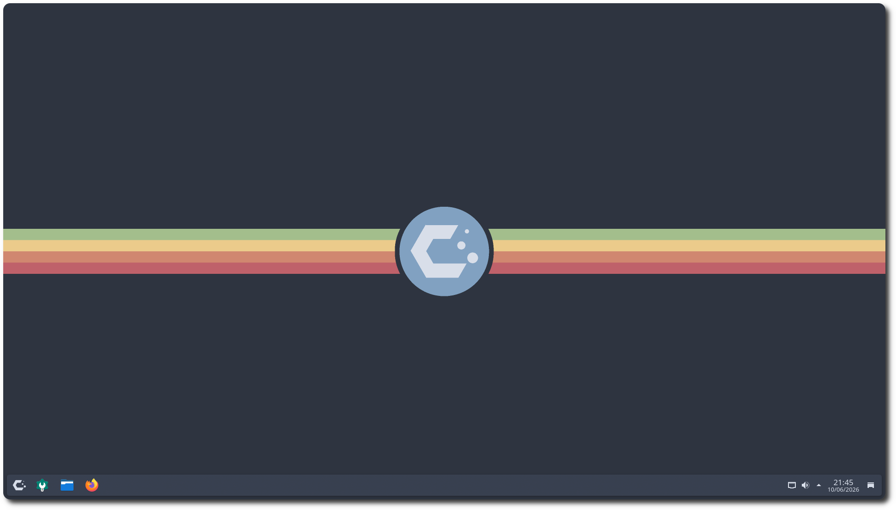

# KDE Dotfiles
A minimal configuration for KDE desktops using the Nord theme




## Details
* **Operational System:** CachyOS
* **Shell:** fish
* **Desktop Environment:** KDE Plasma
* **Window Manager:** Kwin
* **Terminal:** Konsole
* **Fastfetch:** [Fastfetch Config](https://github.com/dacrab/fastfetch-config) 
* **Color Scheme:** Nordic Blue
* **Plasma Theme:** [Polar Gleam](https://store.kde.org/p/2321371)
* **Plasma Window Decorations:** [Nordic](https://store.kde.org/p/1326274/)
* **Icons:** Papirus Dark (Nord folders)
* **Cursors:** [Capitaine Cursors (Nord)](https://store.kde.org/p/1818760)
* **Firefox Theme:** [Nord](https://addons.mozilla.org/pt-BR/firefox/addon/nord123/)
* **VS Code Theme:** [Nord Flat](https://marketplace.visualstudio.com/items?itemName=3ash.nord-flat)

## Installation
Run the installer from the repository root:

```bash
chmod +x install.sh
./install.sh
```

By default, the script copies the files into your home directory and replaces existing targets directly. That includes the Fish config, the Papirus icon theme assets, and a local `start-here-kde-plasma` override based on `assets/app-launcher-logo/cachyos-minimal.svg`

### Optional steps

```bash
./install.sh --apply-theme
```

`--apply-theme` automatically applies the KDE color scheme, Plasma theme, window decoration, icon theme, cursor theme, Konsole default profile, desktop wallpaper, and lockscreen wallpaper for the current logged-in user

```bash
./install.sh --install-cachyos-fish
```

`--install-cachyos-fish` overwrites CachyOS's system fish config at `/usr/share/cachyos-fish-config/cachyos-config.fish` which requires `sudo`. The default install overrides the user-level config