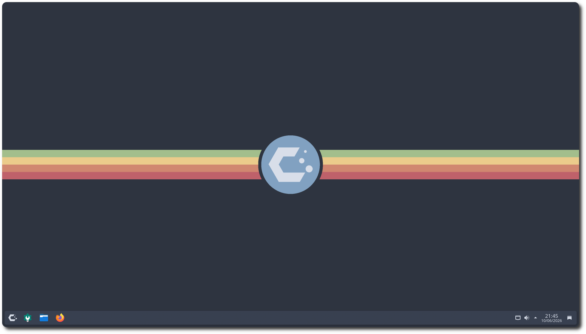

# KDE Dotfiles
A minimal configuration for KDE desktops using the Nord theme




## Details
* **Operational System:** CachyOS
* **Shell:** fish
* **Desktop Environment:** KDE Plasma
* **Window Manager:** Kwin
* **Terminal:** Konsole
* **Fastfetch:** [Fastfetch Config](https://github.com/dacrab/fastfetch-config) 
* **Color Scheme:** Nordic Blue (custom variant based on [Nordic](https://store.kde.org/p/1326271/))
* **Plasma Theme:** [Polar Gleam](https://store.kde.org/p/2321371)
* **Plasma Window Decorations:** [Nordic](https://store.kde.org/p/1326274/)
* **Icons:** Papirus-Dark-Nordic (locally built icon theme of [Papirus Dark](https://store.kde.org/p/1166289)'s Nordic folders)
* **Cursors:** [Capitaine Cursors (Nord)](https://store.kde.org/p/1818760)
* **Firefox Theme:** [Nord](https://addons.mozilla.org/pt-BR/firefox/addon/nord123/)
* **Firefox Config:** [Betterfox](https://github.com/yokoffing/Betterfox)
* **VS Code Theme:** [Nord Flat](https://marketplace.visualstudio.com/items?itemName=3ash.nord-flat)

## Installation
Run the installer from the repository root:

```bash
chmod +x install.sh
./install.sh
```

By default, the script copies the files into your home directory and replaces existing targets directly. It also installs `papirus-icon-theme` with `pacman` and builds a system-wide `Papirus-Dark-Nordic` icon theme under `/usr/local/share/icons` using Nordic folder overrides plus the custom `start-here-kde-plasma` launcher icon from `assets/app-launcher-logo/cachyos-minimal.svg`

The installer also asks which Firefox profile should receive `firefox/user.js`. In non-interactive shells, it falls back to the Firefox `default-release` profile. To target a profile explicitly:

```bash
./install.sh --firefox-profile your-custom-profile
```

To leave Firefox untouched:

```bash
./install.sh --skip-firefox
```

The PSD config is installed to `~/.config/psd/psd.conf` with `BROWSERS=()` so `profile-sync-daemon` does not move Firefox profiles into `/run/user/*/psd`. This avoids the broken-symlink failure mode seen with Firefox profile groups and multiple nested profiles. If `psd.service` is currently active, restart or disable it after installing so the new config is applied

Related notes on PSD and Firefox profile issues:

* [Firefox Profiles Frozen and Corrupted on CachyOS](https://dev.to/muzasio/firefox-profiles-frozen-and-corrupted-on-cachyos-what-broke-and-how-psd-was-the-culprit-39hc)
* [Mozilla Bug 1927027: Linux profile missing after shutdown](https://bugzilla.mozilla.org/show_bug.cgi?id=1927027)

### Optional steps

```bash
./install.sh --apply-theme
```

`--apply-theme` automatically applies the KDE color scheme, Plasma theme, window decoration, icon theme, cursor theme, Konsole default profile, desktop wallpaper, and lockscreen wallpaper for the current logged-in user

```bash
./install.sh --install-cachyos-fish
```

`--install-cachyos-fish` overwrites CachyOS's system fish config at `/usr/share/cachyos-fish-config/cachyos-config.fish`. The default install overrides the user-level config