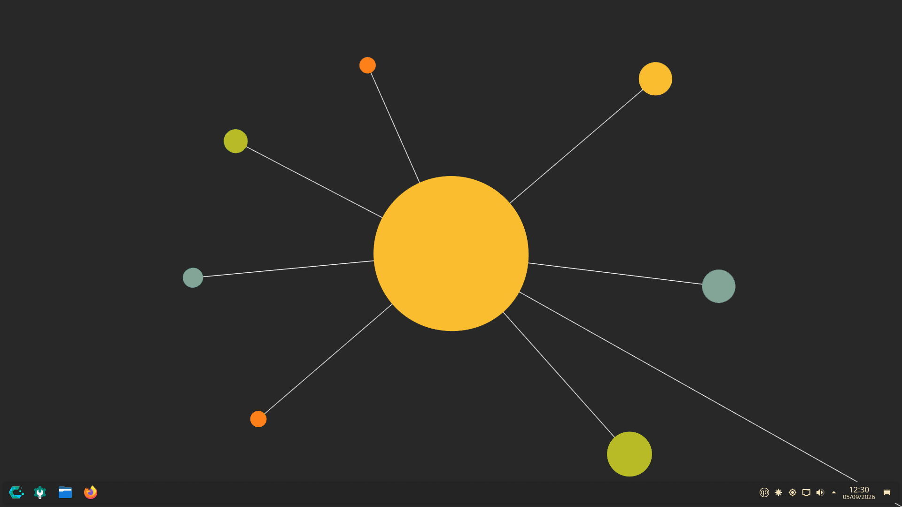
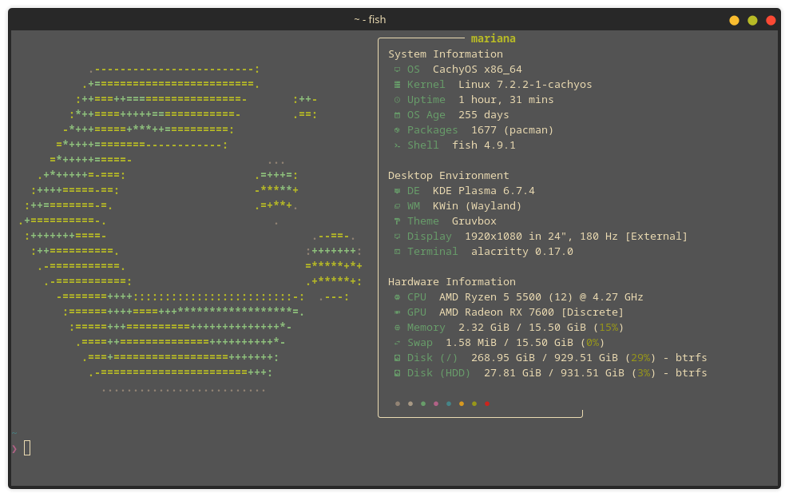

# KDE Dotfiles
A minimal configuration for KDE desktops using the Gruvbox theme




## Details
* **Operational System:** CachyOS
* **Shell:** fish
* **Desktop Environment:** KDE Plasma
* **Window Manager:** Kwin
* **Terminal:** Alacritty
* **Fastfetch:** [Fastfetch Config](https://github.com/dacrab/fastfetch-config) 
* **Color Scheme:** [Dark Pastels / Gruvbox](https://store.kde.org/p/1223601)
* **Plasma Theme:** [Polar Gleam](https://store.kde.org/p/2321371)
* **Plasma Window Decorations:** Gruvbox (recolor of [Nordic](https://store.kde.org/p/1326274/))
* **Icons:** [Papirus Colors Dark](https://store.kde.org/p/1651940)
* **Cursors:** [Capitaine Cursors (Gruvbox)](https://store.kde.org/p/1818760)
* **Firefox Theme:** [Gruvbox](https://addons.mozilla.org/en-US/firefox/addon/gruvboxgruvboxgruvboxgruvboxgr/)
* **Firefox Config:** [Betterfox](https://github.com/yokoffing/Betterfox)
* **VSCodium Theme:** [Gruvbox Theme](https://marketplace.visualstudio.com/items?itemName=jdinhlife.gruvbox)

## Repository layout

* `.config/` - user configs mirrored to `~/.config`
* `.local/` - KDE user themes mirrored to `~/.local/share`
* `usr/` - system-wide files mirrored to `/usr`
* `.vscode-oss/` - VSCodium extensions bundled for offline install
* `_extra/` - auxiliary files not mirrored to any system path

## Installation

Run the installer from the repository root:

```
chmod +x install.sh
./install.sh
```

The script copies the dotfiles into your home directory, replaces existing targets, installs the icon and cursor themes to `/usr/share/icons` (so they appear on the SDDM login screen), sets Alacritty as the default terminal, and bundles the VSCodium settings and extensions. It also sets up [Plasma Panel Colorizer](https://github.com/luisbocanegra/plasma-panel-colorizer) with monochrome tray icons for qBittorrent and ZapZap (the tray-icon replacement feature requires its C++ plugin, installed via `plasma6-applets-panel-colorizer` from the AUR; the script attempts this automatically with `paru`, otherwise install it manually).

### Firefox

The installer asks which Firefox profile should receive `_extra/firefox/user.js`. In non-interactive shells, it falls back to the `default-release` profile.

```
./install.sh --firefox-profile your-custom-profile   # pick a specific profile
./install.sh --skip-firefox                          # leave Firefox untouched
```

The PSD config is installed to `~/.config/psd/psd.conf` with `BROWSERS=()` so `profile-sync-daemon` does not move Firefox profiles into `/run/user/*/psd`, avoiding the broken-symlink failure mode seen with nested profile groups. Restart or disable `psd.service` after installing so the new config is applied. See also:

* [Firefox Profiles Frozen and Corrupted on CachyOS](https://dev.to/muzasio/firefox-profiles-frozen-and-corrupted-on-cachyos-what-broke-and-how-psd-was-the-culprit-39hc)
* [Mozilla Bug 1927027: Linux profile missing after shutdown](https://bugzilla.mozilla.org/show_bug.cgi?id=1927027)

### Optional steps

```
./install.sh --apply-theme
```

Applies the KDE color scheme, Plasma theme, window decoration, icon theme, cursor theme, desktop wallpaper, and lockscreen wallpaper for the current user.

```
./install.sh --install-cachyos-fish
```

Overwrites CachyOS's system fish config at `/usr/share/cachyos-fish-config/cachyos-config.fish` with the version from this repository.